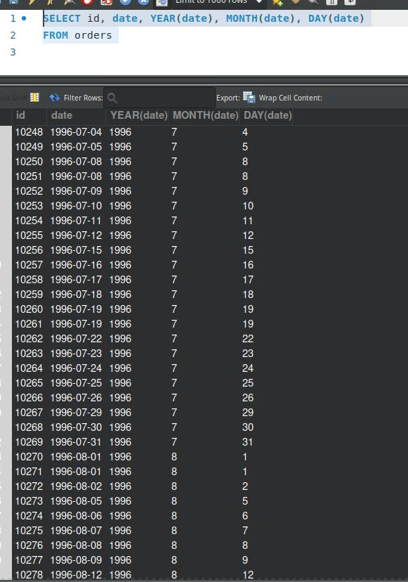
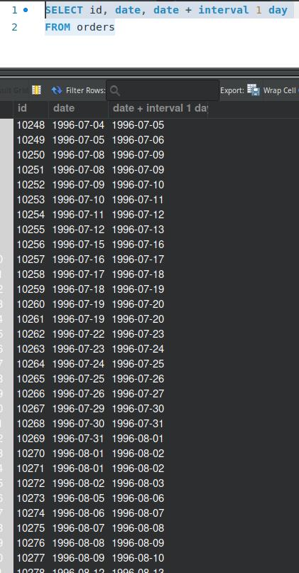
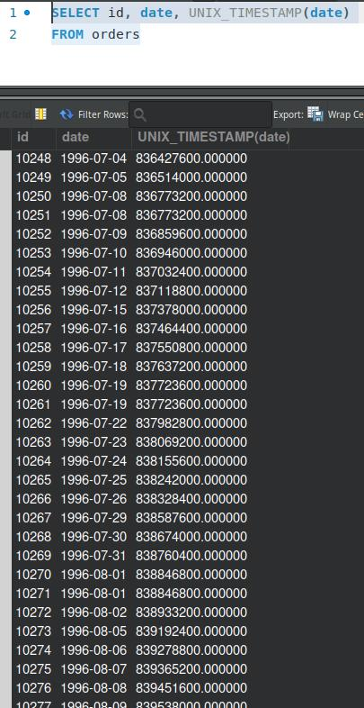
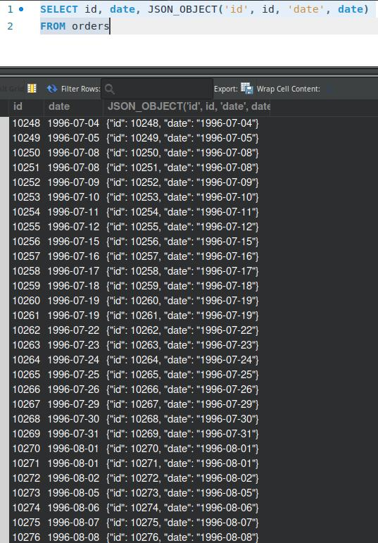

# goit-rdb-hw-07
Домашнє завдання до Теми 7. Додаткові вбудовані SQL функції. Робота з часом

## Завдання №1
Напишіть SQL-запит, який для таблиці orders з атрибута date витягує рік, місяць і число. Виведіть на екран їх у три окремі атрибути поряд з атрибутом id та оригінальним атрибутом date (всього вийде 5 атрибутів).

* p1.sql 
```sql
SELECT id, date, YEAR(date), MONTH(date), DAY(date)
FROM orders
```
* p1.jpg



## Завдання №2
Напишіть SQL-запит, який для таблиці orders до атрибута date додає один день. На екран виведіть атрибут id, оригінальний атрибут date та результат додавання.

* p2.sql
```sql
SELECT id, date, date + interval 1 day
FROM orders
```
* p2.jpg



## Завдання №3
Напишіть SQL-запит, який для таблиці orders для атрибута date відображає кількість секунд з початку відліку (показує його значення timestamp). Для цього потрібно знайти та застосувати необхідну функцію. На екран виведіть атрибут id, оригінальний атрибут date та результат роботи функції.

* p3.sql
```sql
SELECT id, date, UNIX_TIMESTAMP(date)
FROM orders
```
* p3.jpg



## Завдання №4
Напишіть SQL-запит, який рахує, скільки таблиця orders містить рядків з атрибутом date у межах між 1996-07-10 00:00:00 та 1996-10-08 00:00:00.

* p4.sql
```sql
SELECT count(*)
FROM orders
WHERE date between '1996-07-10 00:00:00' and'1996-10-08 00:00:00'
```
* p4.jpg


## Завдання №5
Напишіть SQL-запит, який для таблиці orders виводить на екран атрибут id, атрибут date та JSON-об’єкт {"id": <атрибут id рядка>, "date": <атрибут date рядка>}. Для створення JSON-об’єкта використайте функцію.

* p5.sql
```sql
SELECT id, date, JSON_OBJECT('id', id, 'date', date)
FROM orders
```
* p5.jpg

